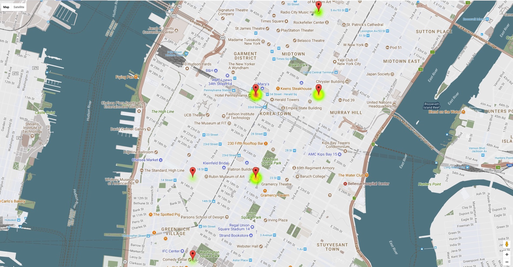

# Hot Spot Analysis Of Large Scale Spatio-temporal Data Using Spark

##### Input: A collection of New York City Yellow Cab taxi trip records for January 2015. The source data may be clipped to an envelope encompassing the five New York City boroughs in order to remove some of the noisy error data (e.g., latitude 40.5N – 40.9N, longitude 73.7W – 74.25W).

##### Output: A list of the fifty most significant hot spot cells in time and space as identified using the Getis-Ord  statistic.

##### Dataset: https://s3.amazonaws.com/nyc-tlc/trip+data/yellow_tripdata_2015-01.csv

### Methodology:

* JavaPairRDDs are formed from the input data 

* Calculate Getis-Ord statistic from above formed RDDs 

### Results:

The results for the analysis are present in [Results](groupTODO_phase3_results.csv)

Heat Map of the results

